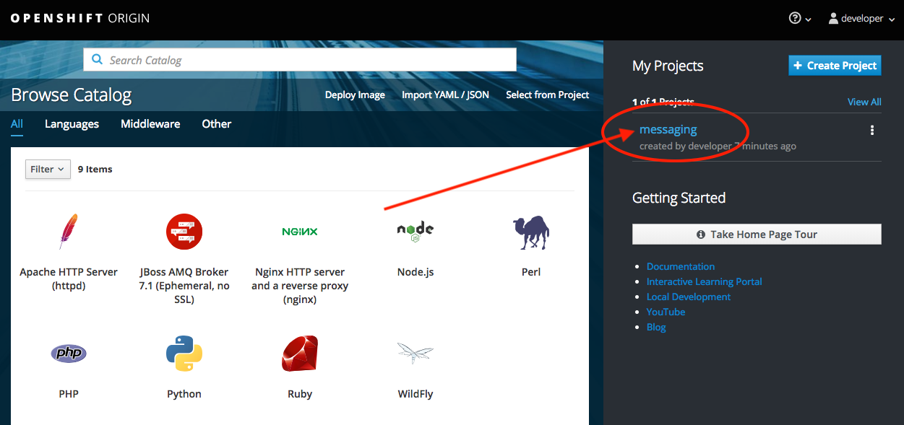
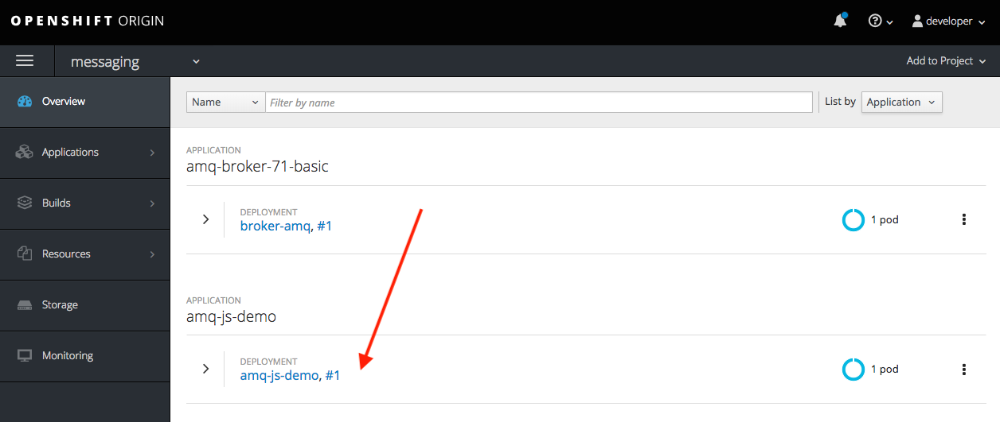
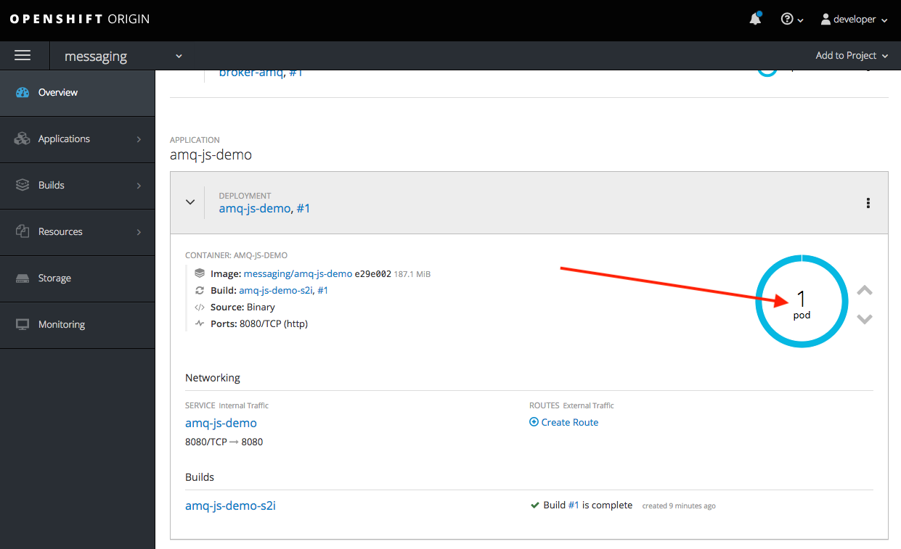
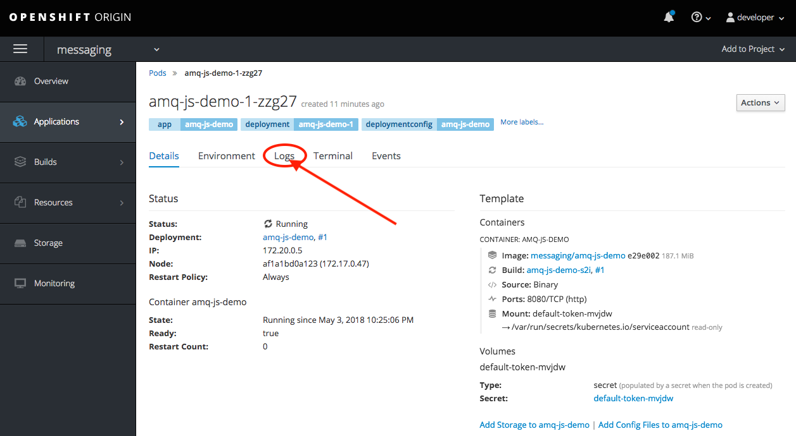

After the previous step build finishes, it will take less than a minute for the application to become available.

> OpenShift ships with a web-based console that will allow users to
perform various tasks via a browser.

### Open the OpenShift Web Console

To get a feel for how the web console works, click on the "OpenShift Console" tab.

The first screen you will see is the authentication screen. Enter your username and password and
then log in.

After you have authenticated to the web console, you will be presented with a
list of projects that your user has permission to work with.

Click on your the `messaging` project name to be taken to the project overview page.

You will see the messaging broker and your brand new application running. Click in the ``amq-js-demo`` row to expand the panel.

Click in the ``1 pod`` inside the blue circle to access the actual pod running your application.

Click in the ``logs`` tab to access the application container logs.

You will see a message every 10 seconds with the following text:

``Message received: Hello World!``

This message is been sent and received to the ``example`` queue by the application you just deployed.